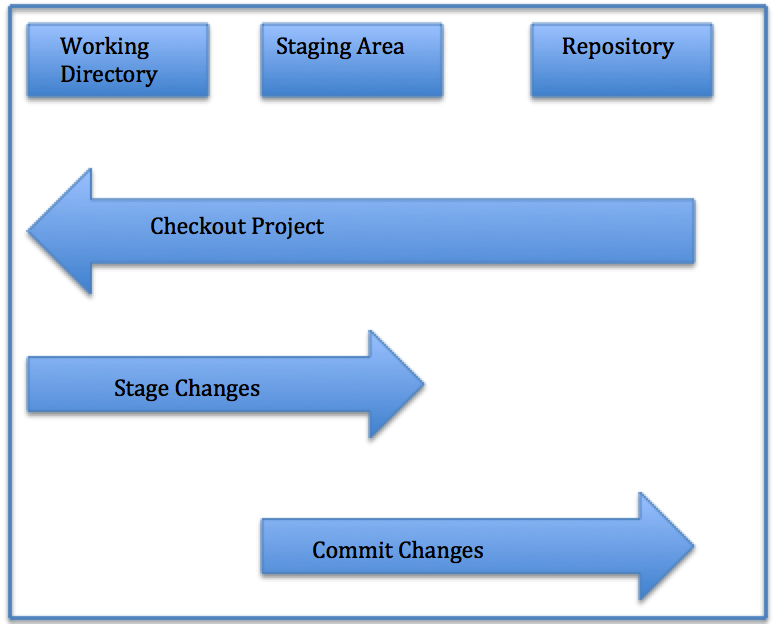

Journal Day 3!
Class night Three!
We are writing in VS CODE & hope to have it save in my github.com once I hit commit...
Maybe we can see changes committed if I run git add -all

Once I've made changes in VS Code I will tell it via command palette "commit all" and save

Then using the command "git push origin master" in the terminal will notify you of all changes that were made in VS Code.

I can then see my changes made in github the website with all updates processed. 

Each time we save a version of our project its called a commit

Stages of Git

